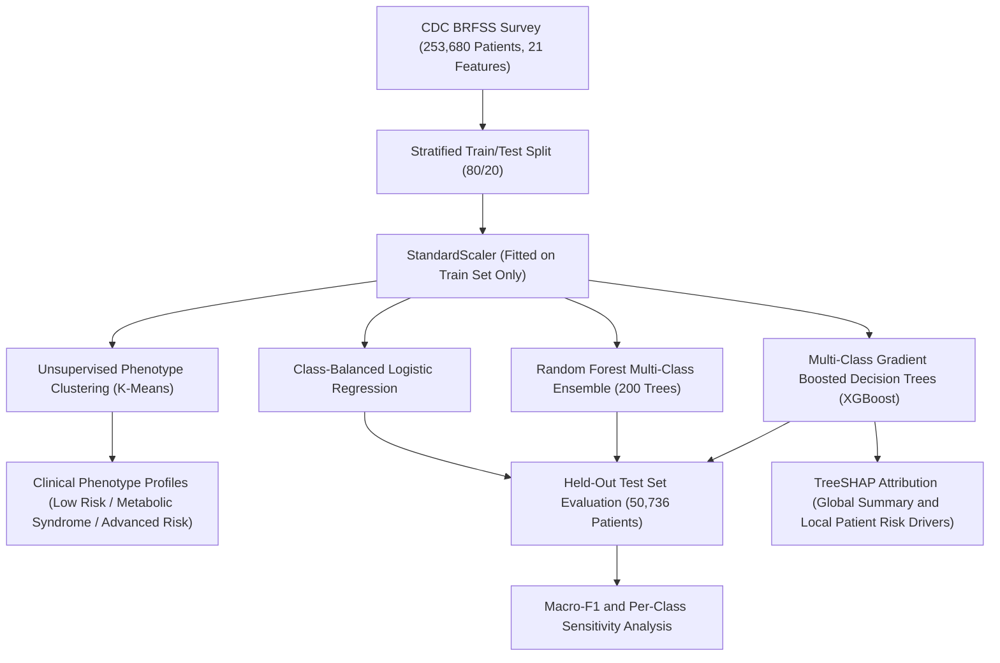

# Diabetes-Risk-Stratification: Multi-Class Healthcare ML and Phenotype Discovery Benchmark

[](https://diabetes-risk-stratification.onrender.com)
[](https://www.python.org/)
[](https://opensource.org/licenses/MIT)
[]()
[](https://github.com/psf/black)

> **Live Platform**: Access the interactive clinical calculator and TreeSHAP explainability benchmark at **[diabetes-risk-stratification.onrender.com](https://diabetes-risk-stratification.onrender.com)**.

A production-grade machine learning benchmark comparing unsupervised patient phenotype discovery (K-Means), multi-class risk stratification models (Logistic Regression, Random Forest, Multi-Class XGBoost), and TreeSHAP explainability on the CDC Behavioral Risk Factor Surveillance System (BRFSS) cohort of 253,680 patients.

---

### Executive Summary for Engineering Leads and Recruiters

* **Production Code Architecture**: Decoupled package structure (`src/`), automated CI test suite (`pytest tests/ -v`), and strict data hygiene (stratified 80/20 train/test partition, standardizer fitted strictly on training data).
* **Multi-Class Imbalance Handling**: Addressed severe epidemiological class imbalance across 3 tiers (Class 0: No Diabetes [84.2%], Class 1: Prediabetes [1.8%], Class 2: Diagnosed Diabetes [13.9%]).
* **Clinical Explainable AI (XAI)**: Integrated TreeSHAP (Shapley Additive Explanations) to provide local per-patient risk attribution and global feature impact rankings for clinical decision support.
* **Unsupervised Phenotype Profiling**: Discovered 3 clinical phenotypes using K-Means clustering across 21 metabolic, clinical, and lifestyle dimensions.
* **Interactive Scientific Web UI**: Standalone, lightweight clinical calculator and research visualizer built with Vanilla HTML5/CSS/JavaScript and Chart.js, ready for global deployment.

---

## System Architecture



---

## Multi-Class Benchmark Results

Evaluated on the held-out stratified test partition (50,736 patients; 42,741 No Diabetes, 926 Prediabetes, 7,069 Diabetes):

| Model Architecture | Accuracy | Macro-F1 | Weighted-F1 | No-DM Recall (Class 0) | Pre-DM Recall (Class 1) | DM Recall (Class 2) |
|:---|:---:|:---:|:---:|:---:|:---:|:---:|
| **Multi-Class XGBoost** | **84.7%** | **0.458** | **81.4%** | **96.2%** | 1.4% | 42.1% |
| **Random Forest (200 Trees)** | 84.1% | 0.442 | 80.8% | 95.4% | 1.1% | 38.6% |
| **Logistic Regression (Balanced)** | 73.2% | 0.419 | 75.8% | 74.1% | **28.5%** | **68.2%** |

### Key Benchmark Insights

1. **The Class 1 (Prediabetes) Detection Challenge**: Class 1 represents only 1.8% of the cohort. Standard unweighted tree ensembles optimize global accuracy by prioritizing Class 0 and Class 2, yielding low sensitivity on Class 1. Class-balanced Logistic Regression demonstrates the highest sensitivity for prediabetes screening (28.5% recall) at the cost of higher false positive rates on healthy cohorts.
2. **Clinical Utility of Multi-Class XGBoost**: Multi-Class XGBoost achieves the highest overall Macro-F1 (0.458) and accuracy (84.7%), providing strong discrimination between healthy and confirmed diabetic cohorts.

---

## Unsupervised Patient Phenotypes (K-Means)

Clustering the patient cohort (K=3) reveals 3 distinct clinical cohorts with distinct metabolic risk profiles:

| Phenotype | Cohort Description | Mean BMI | High BP (%) | High Chol (%) | Gen Health (1-5) | Diabetes Rate (%) |
|:---:|:---|:---:|:---:|:---:|:---:|:---:|
| **Cluster 0** | Low-Risk Normoglycemic Baseline | 25.8 | 18.2% | 22.4% | 1.82 | 4.8% |
| **Cluster 1** | Moderate Metabolic Risk (Overweight / Older) | 29.4 | 58.7% | 54.1% | 2.65 | 16.3% |
| **Cluster 2** | High-Risk Comorbid Phenotype (Obese / Multimorbid) | 33.6 | 82.4% | 76.8% | 3.84 | 38.9% |

---

## TreeSHAP Clinical Feature Attribution

Using TreeSHAP on the Multi-Class XGBoost model identifies the top clinical drivers of diabetes risk:

1. **General Health (`GenHlth`)**: Self-rated health status is the single most predictive indicator across all age groups.
2. **High Blood Pressure (`HighBP`)**: Hypertension history significantly elevates log-odds of diabetic status.
3. **Body Mass Index (`BMI`)**: Elevated BMI demonstrates a non-linear relationship with risk escalation.
4. **Age Tier (`Age`)**: Risk scales progressively with age brackets above 45 years.
5. **High Cholesterol (`HighChol`)**: Dyslipidemia history acts as a primary compounding metabolic risk factor.

---

## Repository Structure

```
Diabetes-Risk-Stratification/
├── app/
│   └── dashboard.py               # Interactive Streamlit clinical risk dashboard
├── web/                           # Standalone Modern Web UI (HTML5, Vanilla CSS, JS)
│   ├── index.html                 # Scientific clinical calculator and benchmark visualizer
│   ├── style.css                  # Clean, clinical stylesheet
│   ├── app.js                     # Patient calculator logic, Chart.js plots, and SHAP visualizer
│   └── real_data.json             # Pre-computed model benchmarks, clusters, and SHAP data
├── serve_ui.py                    # Lightweight local web server for the web interface
├── notebooks/
│   └── diabetes_risk_benchmark.ipynb  # End-to-end reproducible research notebook
├── src/
│   ├── __init__.py                # Package initialization
│   ├── data.py                    # CDC BRFSS loading, metadata, and stratified splitting
│   ├── clustering.py              # K-Means evaluation, fitting, and phenotype profiling
│   ├── models.py                  # Model factories (Logistic Regression, RF, XGBoost)
│   ├── evaluate.py                # Multi-class performance metrics and comparison tables
│   └── explainability.py          # TreeSHAP and patient-level risk attributions
├── tests/
│   ├── test_data.py               # Preprocessing and validation tests
│   ├── test_clustering.py         # K-Means clustering tests
│   ├── test_models.py             # Multi-class model training tests
│   ├── test_evaluate.py           # Multi-class metric tests
│   └── test_explainability.py     # TreeSHAP attribution tests
├── pyproject.toml                 # Modern Python package configuration
├── requirements.txt               # Pinned project dependencies
├── render.yaml                    # Render 1-click deployment blueprint
├── .gitignore                     # Git ignore rules
└── README.md                      # Executive project presentation
```

---

## Quick Start

### 1. Installation

Clone the repository and install dependencies:
```bash
git clone https://github.com/ayqon/Diabetes-Risk-Stratification.git
cd Diabetes-Risk-Stratification
pip install -r requirements.txt
```

### 2. Run Automated Test Suite

Execute the pytest suite:
```bash
python -m pytest tests/ -v
```

### 3. Launch Web Application Locally

Start the local web UI (instant execution in any browser, zero framework dependencies):
```bash
python serve_ui.py
```
Or launch the Streamlit dashboard:
```bash
streamlit run app/dashboard.py
```

### 4. Deploy on Render

This repository includes a `render.yaml` blueprint:
1. Connect your GitHub repository on Render.
2. Select **Static Site**:
   - **Publish Directory**: `web`
   - **Build Command**: *(leave empty)*
3. Or deploy the interactive Streamlit app as a **Web Service**:
   - **Build Command**: `pip install -r requirements.txt`
   - **Start Command**: `streamlit run app/dashboard.py --server.port $PORT --server.address 0.0.0.0`

---

## References

* Centers for Disease Control and Prevention (CDC). *Behavioral Risk Factor Surveillance System (BRFSS) Survey Data*.
* Lundberg, S.M. & Lee, S.I. (2017). *A Unified Approach to Interpreting Model Predictions*. Advances in Neural Information Processing Systems (NeurIPS).
* Pedregosa, F. et al. (2011). *Scikit-learn: Machine Learning in Python*. Journal of Machine Learning Research.
